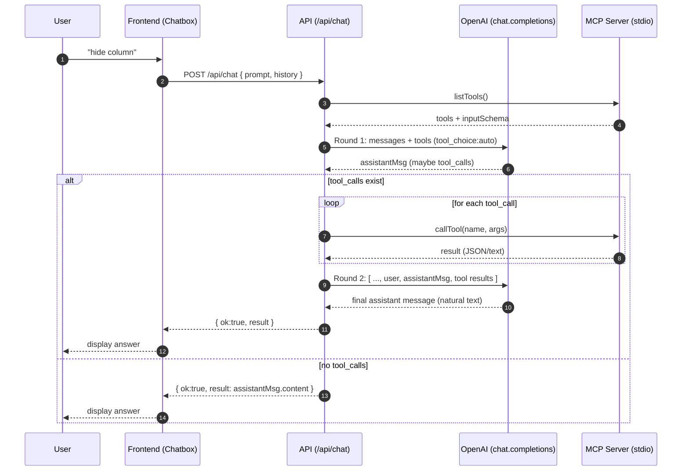

## Step 1:
```
      Create a .env file
        OPENAI_API_KEY='your_OPENAI_API_KEY'
        OPENAI_MODEL='your_OPENAI_MODEL'
```
## Step 2:
```
      cd chatbot-mcp
      npm run buil
      npm run dev:api
```
oaTools
{
  "type": "function",
  "function": {
    "name": "hide_model",
    "description": "Hide a model/part by name or id.",
    "parameters": {
      "type": "object",
      "properties": {
        "target": { "type": "string" }
      },
      "required": ["target"]
    }
  }
}


## OpenAI function calling + MCP


[Show Chart](https://mermaid.live/edit#pako:eNqVVF1v2jAU_StXfsq0NCVAIfVDpaor0iZ1oFFeNqbJJBdiNbEz29lgiP--a0KAfjxsfnHsc8798r3ZslRnyDibK4s_a1QpfpBiZUQ5V0BL1E6rulygac6VME6mshLKwQyEhZl9Cxrde2xktHKoMgjucuEWev3uNfN28tFT_RZcikpepkR9gze-3fPGFSr6CjwrSnVZFeikVvYNxcPdxCv8NkXzCw0E1mVSE7Uhzy5ubkb3HOYslxlCqou6VHPWgKN7QikqDpPx9BGOocEWKkN-XQi5tE6bDexag0QnETnkUBD2qHVhg0NkdHvRWnQegPcgVVW7aZpjKc4NUKocvuiaChdzKNFasULPb3SB336kuZYpcv8-x4RIePQhrKUQqA4PdgVBKTYLhEYoisIeJaJwZ9eAaxI1iF-F1hUstQEUaX7inQgvsvagzzpQosQQhFm1D9Ou8zIYtDW5Dz5Nx58vHa7dGZe65nR4VZYuh28QRVEINbVf-CzZcB_nwbiF7ycz5-VZSiWKk66tMlDkrjYEvYjHh3Boly3oJ-5MTQkeMtideNQ2RJtxyKStCrEBoezvdkKwsAhKnxX83xw8f01qez9V_-FWZSxkKyMz1phlJZpS-CPbesqcOepBnDM_C5kwT34IdqShOfqqddnKjK5XOeNLQXmErK4y4dq_xfHWkDc0d_RMjvG4M9gbYXzL1ownnagb94eDpBMn3XjYiUO2IVI8jAb9uJdcd667w6thL96F7M_ebScaDq4Gg7jbj5Ok1-8lu796x3Kt)


## Kill server
  lsof -i :8787
  kill

## MCP Configuration
```
  {
  "command": "npx",
        "args": [
          "-y",
          "mcp-remote",
          " http://localhost:8787/mcp"
        ]
  }
```


ANALYZE=true pnpm run build

# 4. Start a local PostgreSQL instance
pnpm docker:pg